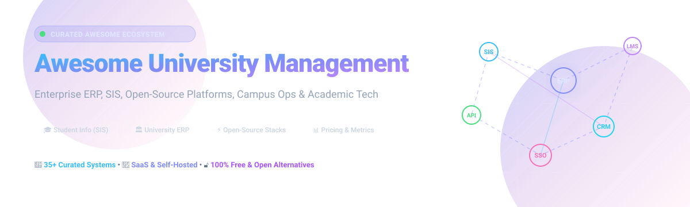

<p align="center">
  
</p>

# 🎓 Awesome University Management

<p align="center">
  <a href="https://github.com/ishandutta2007/Awesome-Awesome-Awesome"></a><a href="https://discord.gg/jc4xtF58Ve"></a> <a href="https://github.com/ishandutta2007/Awesome-University-Management/stargazers"></a> <a href="https://github.com/ishandutta2007/Awesome-University-Management/network/members"></a> <a href="https://github.com/ishandutta2007/Awesome-University-Management/issues"></a> <a href="https://github.com/ishandutta2007/Awesome-University-Management/blob/main/LICENSE"></a> <a href="https://github.com/ishandutta2007"></a>
</p>

## 🏛️ Top University Management Ecosystem

**Curated List of SaaS Products & Open-Source GitHub Projects**

*Focused on University ERP, Student Information Systems (SIS), Campus Administration, Admissions, Academics, Finance, HR, Student Services & Institutional Operations*

**📅 Last updated: August 2026**

---

### 🌐 Overview & Architecture Context

This repository tracks notable **SaaS/hosted platforms** and **open-source projects** for **University Management, Higher-Education ERP, Student Information Systems (SIS), Campus Management, Student Lifecycle Management, Academic Administration, Admissions, Registration, Finance, HR, Learning Administration and Institutional Operations**.

These systems help universities and colleges manage the complete student and institutional lifecycle, including **prospective-student recruitment, admissions, applications, student records, programs, curriculum, course catalogues, registration, scheduling, attendance, grades, transcripts, advising, financial aid, student accounts, billing, faculty workload, HR, payroll, procurement, facilities, alumni and reporting**.

**Key Industry Examples** include Ellucian Banner, Anthology Student, Workday Student, Oracle PeopleSoft Campus Solutions, Jenzabar ONE, Unit4 Student Management, CampusCafe, Academia ERP, Classe365 and Populi.

* **[Ellucian Banner](https://www.ellucian.com/)** provides a comprehensive higher-education student-information environment covering admissions, advising, degree planning, registration, academic records, student/faculty self-service, course catalogues, scheduling and institutional administration.
* **[Anthology Student](https://www.anthology.com/)** is a cloud-based SIS/ERP designed around the student lifecycle while also supporting institutional operations, including finance, financial aid, faculty workload and payroll. Anthology's SIS/ERP business was acquired by Ellucian in 2025/2026, while the product continues to be supported within the Ellucian ecosystem.
* **Open-source emphasis**: This repository deliberately gives substantial attention to open-source alternatives and building blocks. A complete open-source one-to-one replacement for Workday Student, Banner or PeopleSoft Campus Solutions is still uncommon. The strongest open ecosystem instead combines **OpenEduCat, Frappe Education, openSIS, RosarioSIS, Fedena, Gibbon, ERPNext, Moodle, OpenProject and other open-source academic, ERP and student-information components**.
* **[OpenEduCat](https://github.com/openeducat/openeducat_erp)** is one of the strongest open-source education-ERP candidates, providing modules for admissions, students, academics, exams, attendance, fees, library, facilities, parents, timetables and more. Its current Community Edition repository is LGPL-3.0 licensed.
* **[Frappe Education](https://github.com/frappe/education)** is another strong foundation, built on the Frappe/ERPNext ecosystem and covering student/teacher management, admissions, fees, course scheduling, exams, attendance and a student portal.
* **[openSIS Classic](https://github.com/OS4ED/openSIS-Classic)** provides an open-source SIS covering student/staff data, courses, scheduling, attendance, grades, transcripts, communication and reporting.
* **[RosarioSIS](https://github.com/francoisjacquet/rosariosis)** and **[Fedena](https://github.com/projectfedena/fedena)** are additional long-running open-source SIS projects. RosarioSIS is GPLv2, while Fedena is Apache 2.0.

Contributions welcome! Open a PR to add/update entries. Keep descriptions factual and link to official sites or GitHub repositories.

---

## 📑 Table of Contents

* [🏢 SaaS / Hosted Platforms](#-saashosted-platforms)
* [💻 Open-Source GitHub Projects](#-open-source-github-projects)
  * [🎓 Full Education ERP / University Management](#-full-education-erp--university-management)
  * [📚 Academic / Learning Management & Classrooms](#-academic--learning-management--classrooms)
  * [🎯 Admissions, CRM & Enterprise Foundations](#-admissions-crm--enterprise-foundations)
  * [🤝 Student Services, Collaboration, Library & Campus Ops](#-student-services-collaboration-library--campus-ops)
  * [⏰ Timetabling & Academic Scheduling](#-timetabling--academic-scheduling)
  * [🔐 Identity, Integration & Campus APIs](#-identity-integration--campus-apis)
* [🌟 Additional Strong Open-Source Options](#-additional-strong-open-source-options)
* [🏗️ Recommended Open-Source University Management Stack](#%EF%B8%8F-recommended-open-source-university-management-stack)
* [📊 Suggested University Data Model](#-suggested-university-data-model)
* [🔄 University Integration Architecture](#-university-integration-architecture)
* [📈 Star History](#-star-history)
* [🤝 How to Contribute](#-how-to-contribute)
* [⚠️ Disclaimer](#%EF%B8%8F-disclaimer)

---


## 🏢 SaaS/Hosted Platforms

The table below details major commercial Higher Education Student Information Systems (SIS) and ERP solutions, sorted in descending order by parent company scale (valuation / market capitalization and annual revenue).

| Product | Description / Core Focus | Company Size (Valuation / Annual Revenue) | Starting Tier Pricing | Free Tier / Free Trial Limits |
| :--- | :--- | :--- | :--- | :--- |
| **[Oracle PeopleSoft Campus Solutions](https://www.oracle.com/industries/higher-education/campus-solutions/)** | 🏛️ Enterprise SIS for higher education covering admissions, student records, curriculum, enrollment, degree audit, financial aid, and student financials. | **~$450B Valuation** (~$53B Annual Revenue — Oracle Corporation) | Starts at ~$120/FTE student/year or ~$4,500/named application user (standard Oracle metric base entry) | No free forever plan (OCI offers 30-day / $300 credit cloud trial, but Campus Solutions application requires guided vendor demo) |
| **[Workday Student](https://www.workday.com/en-us/products/student.html)** | ☁️ Cloud-native higher-education student-management platform integrated with Workday financial management, HCM, advising, and predictive analytics. | **~$70B Valuation** (~$8.5B Annual Revenue — Workday, Inc.) | Starts at ~$100,000/year (baseline enterprise subscriptions start around ~$80–$100/user/year with annual institutional minimums) | No free forever plan; guided live interactive product demo and sandbox environment upon enterprise qualification |
| **[Ellucian Banner](https://www.ellucian.com/)** | 🎓 Enterprise higher-education ERP/SIS ecosystem covering student records, admissions, advising, degree planning, registration, financial aid, student accounts, finance, and HR. | **~$5.0B+ Valuation** (~$1.2B Annual Revenue — Ellucian / Vista & Blackstone) | Starts at ~$10,000 – $50,000/year for base institutional tiers (scales to $100k+/year for full enterprise ERP suite) | No free forever plan; 30-day guided evaluation sandbox & live pilot demo upon institutional qualification |
| **[Ellucian Colleague](https://www.ellucian.com/)** | 🏫 Higher-education ERP/SIS serving institutions with student, finance, HR, and administrative capabilities as part of the broader Ellucian ecosystem. | **~$5.0B+ Valuation** (~$1.2B Annual Revenue — Ellucian / Vista & Blackstone) | Starts at ~$30,000 – $60,000/year for base small-to-mid college tier | No free forever plan; customized institutional demo and consultation sandbox upon request |
| **[PowerCampus](https://www.ellucian.com/)** | 📦 Integrated higher-education SIS/ERP technology for independent colleges managing admissions, student records, billing, and advancement. | **~$5.0B+ Valuation** (~$1.2B Annual Revenue — Ellucian / Vista & Blackstone) | Starts at ~$15,000 – $25,000/year for entry institutional licensing | No free forever plan; vendor-assisted live demonstration and migration evaluation on request |
| **[Unit4 Student Management](https://www.unit4.com/)** | ⚙️ Next-gen higher-education student management supporting admissions, curriculum, enrollment, billing, and lifecycle workflows within Unit4 ERP. | **~$2.0B+ Valuation** (~$500M+ Annual Revenue — Unit4 / TA Associates) | Starts at ~$80 – $150/user/month (entry institutional packages start around ~$25,000/year) | No permanent free tier; commitment-free "AI for Your World" trial through August 31, 2027 for ERPx capabilities, or 14–30 day guided pilot upon RFP |
| **[Anthology Student](https://www.anthology.com/)** | 🌐 Cloud-based student-information and enterprise-resource platform supporting the student lifecycle, financial aid, finance, and faculty workload (part of Ellucian ecosystem). | **~$1.5B+ Valuation** (~$400M+ Annual Revenue — Anthology / Veritas Capital) | Starts at ~$10,000 – $25,000/year (or ~$12–$16/student/year equivalent for initial modular tiers) | No free forever plan; tailored institutional sandbox pilot upon scheduled consultation |
| **[Modern Campus](https://moderncampus.com/)** | 📱 Higher-education digital engagement ecosystem covering curriculum, course catalog, non-traditional student enrollment, and scheduling. | **~$500M+ Valuation** (~$100M+ Annual Revenue — The Riverside Company) | Starts at ~$8,000 – $15,000/year (for entry module such as Catalog & Curriculum / Omni CMS) | No free forever plan; guided live interactive product demo on request |
| **[Jenzabar ONE](https://jenzabar.com/jenzabar-one)** | 🚀 Unified cloud ERP/SIS platform designed for higher education, supporting student success, retention, finance, HR, and institutional data. | **~$350M+ Valuation** (~$100M+ Annual Revenue — Jenzabar, Inc.) | Starts at ~$20,000 – $35,000/year (base institutional package; consortium discounts available) | No free forever plan; customized live demonstration & evaluation sandbox upon request |
| **[Jenzabar Student](https://jenzabar.com/product/student)** | 📈 Higher-education SIS focused on student lifecycle management, engagement, course scheduling, and academic administration. | **~$350M+ Valuation** (~$100M+ Annual Revenue — Jenzabar, Inc.) | Starts at ~$1,500/month (~$18,000/year for specialized or small-to-mid institutions) | No free forever plan; scheduled interactive product demo on demand |
| **[CampusCafe](https://www.campuscafesoftware.com/)** | ☕ Higher-education campus management and SIS supporting admissions, student records, registration, advising, billing, financial aid, and housing. | **~$25M+ Valuation** (~$8M+ Annual Revenue — Campus Café Software) | Starts at $1,200/month (billed annually, ~$14,400/year) | No free forever plan; 14-day evaluation sandbox & guided interactive demo on request |
| **[Academia ERP](https://www.academiaerp.com/)** | 📊 Complete education ERP platform unifying student information, admissions, fee management, examinations, attendance, and administrative reporting. | **~$20M+ Valuation** (~$6M+ Annual Revenue — Serosoft Solutions) | Starts at ~$1.50 – $3.00/student/year (or entry SaaS tier starting at ~$500/month / ₹35,000/month for small campuses) | No free forever plan; 14-day guided proof-of-concept / live demo workshop upon registration |
| **[Populi](https://www.populiweb.com/)** | 💼 All-in-one cloud higher-education management platform integrating SIS, admissions, billing, financial aid, and lightweight LMS. | **~$15M+ Valuation** (~$5M+ Annual Revenue — Populi, Inc.) | Starts at $199/month base fee + $9/month per billable student (includes 2,000 GB storage and 200 GB transfer/month) | 30-day free trial (full platform access, no credit card required, demo setup included); no permanent free tier |
| **[Classe365](https://www.classe365.com/)** | 💻 Cloud student-information and education-management platform covering admissions CRM, student records, billing, LMS, and communication. | **~$10M+ Valuation** (~$3M+ Annual Revenue — Craydel / Classe365) | Starts at $100/month (Core SIS module for up to 100 students; includes unlimited teachers, admins, and parents) | 15-day free trial (full module access, no credit card required); no permanent free tier |


## 💻 Open-Source GitHub Projects

> ℹ️ **Note:** The projects below range from full open-source education ERPs and SIS platforms to LMS, admissions, ERP, identity and integration components that can collectively form an enterprise university-management ecosystem. Repositories in each category are sorted in **descending order by GitHub star count**.

### 🎓 Full Education ERP / University Management

* **[OpenEduCat Community Edition](https://github.com/openeducat/openeducat_erp)** [](https://github.com/openeducat/openeducat_erp/stargazers)
  
  **Open-source education ERP — strongest overall candidate.**
  Comprehensive education ERP based on Odoo, with modules for admissions, student information, courses, batches, classrooms, examinations, attendance, fees, library, facilities, parents, timetables, communication and reporting. The current Community Edition repository is LGPL-3.0 licensed.

* **[RosarioSIS](https://github.com/francoisjacquet/rosariosis)** [](https://github.com/francoisjacquet/rosariosis/stargazers)
  
  **Open-source Student Information System (SIS).**
  Full-featured web-based SIS covering students, teachers, administrators, attendance, grades, billing, reports, plugins and communications. Released under GPL-2.0.

* **[Gibbon](https://github.com/GibbonEdu/core)** [](https://github.com/GibbonEdu/core/stargazers)
  
  **Open-source school and campus management platform.**
  Modular web-based education-management platform covering student information, attendance, timetables, activities, assessments, finance-related workflows and school administration.

* **[Frappe Education](https://github.com/frappe/education)** [](https://github.com/frappe/education/stargazers)
  
  **Open-source education management system.**
  Education-management application built on Frappe/ERPNext. It includes student and teacher management, admissions, fees, course scheduling, examination planning, attendance and a student portal, with ERPNext providing the underlying accounting, inventory and enterprise infrastructure.

* **[Fedena](https://github.com/projectfedena/fedena)** [](https://github.com/projectfedena/fedena/stargazers)
  
  **Open-source school/campus management system.**
  Ruby-on-Rails-based education-management system covering student and campus records and a broad range of school-management functions. Released under Apache License 2.0.

* **[openSIS Classic](https://github.com/OS4ED/openSIS-Classic)** [](https://github.com/OS4ED/openSIS-Classic/stargazers)
  
  **Open-source Student Information System.**
  Web-based SIS covering student and staff data, course management, scheduling, attendance, grades, teacher gradebook, progress reports, transcripts, communication and bulk imports.

---

### 📚 Academic / Learning Management & Classrooms

* **[BigBlueButton](https://github.com/bigbluebutton/bigbluebutton)** [](https://github.com/bigbluebutton/bigbluebutton/stargazers)
  
  **Open-source virtual classroom and lecture web-conferencing system.**
  Designed specifically for online learning and higher-education lectures, offering real-time audio/video sharing, interactive whiteboards, polling, breakout rooms, and deep LMS integration.

* **[Open edX](https://github.com/openedx/edx-platform)** [](https://github.com/openedx/edx-platform/stargazers)
  
  **Open-source scalable learning platform.**
  Massive open online course (MOOC) and blended campus learning platform suitable for universities offering structured online courses, degrees, and micro-credentials.

* **[Moodle](https://github.com/moodle/moodle)** [](https://github.com/moodle/moodle/stargazers)
  
  **Open-source Learning Management System (LMS).**
  The world's most widely adopted open-source LMS, providing comprehensive course authoring, assignments, grading, quizzes, learning pathways, authentication, and an extensive plugin ecosystem.

* **[Canvas LMS](https://github.com/instructure/canvas-lms)** [](https://github.com/instructure/canvas-lms/stargazers)
  
  **Open-source core learning-management system.**
  Modern open-source LMS platform supporting courses, assignments, SpeedGrader, communication, LTI integrations, and academic workflows.

* **[Chamilo LMS](https://github.com/chamilo/chamilo-lms)** [](https://github.com/chamilo/chamilo-lms/stargazers)
  
  **Open-source LMS & e-learning system.**
  Learning-management system providing courses, assessments, learning paths, skills management, and learner-tracking capabilities.

* **[ILIAS](https://github.com/ILIAS-eLearning/ILIAS)** [](https://github.com/ILIAS-eLearning/ILIAS/stargazers)
  
  **Open-source enterprise LMS.**
  Mature learning-management platform supporting courses, assessments, SCORM, learning objects, collaboration, and granular user permissions.

---

### 🎯 Admissions, CRM & Enterprise Foundations

* **[Odoo Community](https://github.com/odoo/odoo)** [](https://github.com/odoo/odoo/stargazers)
  
  **Open-source enterprise ERP framework.**
  Provides core accounting, HR, CRM, inventory, purchasing, and workflow functionality. Serves as the robust technical foundation for OpenEduCat.

* **[ERPNext](https://github.com/frappe/erpnext)** [](https://github.com/frappe/erpnext/stargazers)
  
  **Open-source enterprise ERP system.**
  Provides institutional accounting, HR, payroll, procurement, asset management, and student fee management, powering the Frappe Education platform.

* **[SuiteCRM](https://github.com/SuiteCRM/SuiteCRM)** [](https://github.com/SuiteCRM/SuiteCRM/stargazers)
  
  **Open-source enterprise CRM foundation.**
  Ideal for prospective-student recruitment, admissions CRM funnels, campaign tracking, applicant communications, and alumni relationship management.

* **[EspoCRM](https://github.com/espocrm/espocrm)** [](https://github.com/espocrm/espocrm/stargazers)
  
  **Open-source lightweight CRM.**
  Provides fast, responsive applicant tracking and recruitment CRM workflows to complement an open SIS.

---

### 🤝 Student Services, Collaboration, Library & Campus Ops

* **[Discourse](https://github.com/discourse/discourse)** [](https://github.com/discourse/discourse/stargazers)
  
  **Open-source campus community and discussion platform.**
  Modern student forum, peer-to-peer discussion board, and academic knowledge-sharing platform with SSO, moderation, and mobile support.

* **[Nextcloud Server](https://github.com/nextcloud/server)** [](https://github.com/nextcloud/server/stargazers)
  
  **Open-source campus cloud storage & collaboration suite.**
  Self-hosted file sync, document editing (OnlyOffice/Collabora), student assignment dropboxes, and institutional data compliance.

* **[OpenProject](https://github.com/opf/openproject)** [](https://github.com/opf/openproject/stargazers)
  
  **Open-source project management platform.**
  Useful for managing university research grants, accreditation initiatives, curriculum revisions, and campus development projects.

* **[Snipe-IT](https://github.com/snipe/snipe-it)** [](https://github.com/snipe/snipe-it/stargazers)
  
  **Open-source IT asset management system.**
  Tracks campus hardware, laboratory equipment, university laptops, software licenses, and departmental asset checkouts.

* **[Frappe Framework](https://github.com/frappe/frappe)** [](https://github.com/frappe/frappe/stargazers)
  
  **Open-source full-stack web framework.**
  Rapid application development platform for building custom university portals, micro-apps, forms, workflows, and REST APIs.

* **[GLPI](https://github.com/glpi-project/glpi)** [](https://github.com/glpi-project/glpi/stargazers)
  
  **Open-source IT service management (ITSM) & Helpdesk.**
  Provides student and faculty helpdesk ticketing, campus IT asset tracking, maintenance workflows, and service level management.

* **[DSpace](https://github.com/DSpace/DSpace)** [](https://github.com/DSpace/DSpace/stargazers)
  
  **Open-source digital institutional repository.**
  The premier platform for university libraries and research offices to archive, preserve, and provide open access to academic papers, theses, dissertations, and digital collections.

* **[Koha](https://github.com/Koha-Community/Koha)** [](https://github.com/Koha-Community/Koha/stargazers)
  
  **Open-source Integrated Library System (ILS).**
  The world's leading open-source library automation system, handling cataloging, circulation, patron management, serials, and OPAC for academic libraries.

---

### ⏰ Timetabling & Academic Scheduling

* **[OptaPlanner](https://github.com/apache/incubator-kie-optaplanner)** [](https://github.com/apache/incubator-kie-optaplanner/stargazers)
  
  **Constraint-optimization & scheduling engine.**
  Automates complex university timetable generation, exam scheduling, room allocation, faculty assignment, and capacity planning.

* **[Timefold Solver](https://github.com/TimefoldAI/timefold-solver)** [](https://github.com/TimefoldAI/timefold-solver/stargazers)
  
  **AI-driven constraint satisfaction solver.**
  Next-generation fork of OptaPlanner, providing fast algorithms for school/university timetabling, exam scheduling, and resource allocation.

* **[UniTime](https://github.com/UniTime/unitime)** [](https://github.com/UniTime/unitime/stargazers)
  
  **Comprehensive open-source university scheduling system.**
  Specialized higher-education system supporting course timetabling, classroom allocation, student course requests, and examination scheduling.

* **[FET Timetable Generator](https://github.com/karandit/fet)** [](https://github.com/karandit/fet/stargazers)
  
  **Automated educational timetable generator.**
  Lightweight and fast algorithmic scheduling software capable of solving complex multi-departmental educational scheduling constraints.

---

### 🔐 Identity, Integration & Campus APIs

* **[Keycloak](https://github.com/keycloak/keycloak)** [](https://github.com/keycloak/keycloak/stargazers)
  
  **Open-source identity and access management (IAM).**
  Enables campus-wide Single Sign-On (SSO), OAuth 2.0, OpenID Connect, SAML 2.0, LDAP/Active Directory federation, and role-based access control.

* **[Apache Kafka](https://github.com/apache/kafka)** [](https://github.com/apache/kafka/stargazers)
  
  **Distributed event-streaming platform.**
  Connects admissions, SIS, LMS, finance, library, and alumni systems via reliable asynchronous event-driven pipelines.

* **[Apache Camel](https://github.com/apache/camel)** [](https://github.com/apache/camel/stargazers)
  
  **Enterprise integration framework.**
  Provides hundreds of connectors and enterprise integration patterns (EIP) to link legacy campus databases, SIS platforms, APIs, and cloud services.

* **[Mirth Connect / NextGen Connect](https://github.com/nextgenhealthcare/connect)** [](https://github.com/nextgenhealthcare/connect/stargazers)
  
  **Data transformation and integration engine.**
  Enterprise integration engine useful for mapping, transforming, and routing complex data formats across disparate campus administrative systems.


## 🌟 Additional Strong Open-Source Options

The following projects provide essential building blocks for an integrated open university-management architecture:

* **[OpenEduCat](https://github.com/openeducat/openeducat_erp)** [](https://github.com/openeducat/openeducat_erp/stargazers) for integrated education ERP and student administration.
* **[Discourse](https://github.com/discourse/discourse)** [](https://github.com/discourse/discourse/stargazers) for campus-wide community discussions.
* **[ERPNext](https://github.com/frappe/erpnext)** [](https://github.com/frappe/erpnext/stargazers) for university finance, HR, payroll, procurement, and asset management.
* **[Keycloak](https://github.com/keycloak/keycloak)** [](https://github.com/keycloak/keycloak/stargazers) for campus SSO and identity federation.
* **[Nextcloud Server](https://github.com/nextcloud/server)** [](https://github.com/nextcloud/server/stargazers) for campus file sharing, cloud storage, and collaboration.
* **[Apache Kafka](https://github.com/apache/kafka)** [](https://github.com/apache/kafka/stargazers) for event-driven campus integration bus.
* **[Snipe-IT](https://github.com/snipe/snipe-it)** [](https://github.com/snipe/snipe-it/stargazers) for campus IT equipment and laboratory asset tracking.
* **[OpenProject](https://github.com/opf/openproject)** [](https://github.com/opf/openproject/stargazers) for institutional project management and accreditation tracking.
* **[BigBlueButton](https://github.com/bigbluebutton/bigbluebutton)** [](https://github.com/bigbluebutton/bigbluebutton/stargazers) for interactive virtual classrooms and lectures.
* **[Open edX](https://github.com/openedx/edx-platform)** [](https://github.com/openedx/edx-platform/stargazers) for large-scale online courses and MOOCs.
* **[Moodle](https://github.com/moodle/moodle)** [](https://github.com/moodle/moodle/stargazers) for learning management and course authoring.
* **[Canvas LMS](https://github.com/instructure/canvas-lms)** [](https://github.com/instructure/canvas-lms/stargazers) for academic LMS workflows.
* **[GLPI](https://github.com/glpi-project/glpi)** [](https://github.com/glpi-project/glpi/stargazers) for campus IT service management and helpdesk.
* **[Apache Camel](https://github.com/apache/camel)** [](https://github.com/apache/camel/stargazers) for application integration and ETL.
* **[SuiteCRM](https://github.com/SuiteCRM/SuiteCRM)** [](https://github.com/SuiteCRM/SuiteCRM/stargazers) for admissions CRM and student outreach.
* **[EspoCRM](https://github.com/espocrm/espocrm)** [](https://github.com/espocrm/espocrm/stargazers) for applicant relationship management.
* **[Timefold Solver](https://github.com/TimefoldAI/timefold-solver)** [](https://github.com/TimefoldAI/timefold-solver/stargazers) for AI timetabling and constraint scheduling.
* **[DSpace](https://github.com/DSpace/DSpace)** [](https://github.com/DSpace/DSpace/stargazers) for digital research archives and university theses.
* **[Chamilo](https://github.com/chamilo/chamilo-lms)** [](https://github.com/chamilo/chamilo-lms/stargazers) for learning management.
* **[RosarioSIS](https://github.com/francoisjacquet/rosariosis)** [](https://github.com/francoisjacquet/rosariosis/stargazers) for student records and academic administration.
* **[Gibbon](https://github.com/GibbonEdu/core)** [](https://github.com/GibbonEdu/core/stargazers) for modular school/campus administration.
* **[Frappe Education](https://github.com/frappe/education)** [](https://github.com/frappe/education/stargazers) for education management built on ERPNext.
* **[Koha](https://github.com/Koha-Community/Koha)** [](https://github.com/Koha-Community/Koha/stargazers) for university library automation (ILS).
* **[Fedena](https://github.com/projectfedena/fedena)** [](https://github.com/projectfedena/fedena/stargazers) for campus and school management.
* **[ILIAS](https://github.com/ILIAS-eLearning/ILIAS)** [](https://github.com/ILIAS-eLearning/ILIAS/stargazers) for learning and assessment.
* **[UniTime](https://github.com/UniTime/unitime)** [](https://github.com/UniTime/unitime/stargazers) for university course and examination scheduling.
* **[openSIS Classic](https://github.com/OS4ED/openSIS-Classic)** [](https://github.com/OS4ED/openSIS-Classic/stargazers) for student information management.


## 🏗️ Recommended Open-Source University Management Stack

For organizations seeking to architect an **open-source alternative to Ellucian Banner, Anthology Student, Workday Student, Oracle PeopleSoft Campus Solutions, Jenzabar ONE, Unit4 Student Management, CampusCafe, Academia ERP, Classe365 or Populi**, a practical modular stack combines:

```text
🏛️ Student Information System / Education ERP
   └── OpenEduCat / Frappe Education / openSIS
       ↓
🎯 Student Lifecycle
   └── Prospect → Applicant → Admission → Enrollment → Registration → Progression → Graduation → Alumni
       ↓
📚 Academic Administration
   └── Programs + Curriculum + Courses + Sections + Faculty + Classrooms
       ↓
⏰ Scheduling & Timetabling
   └── UniTime / Timefold Solver / OptaPlanner / FET
       ↓
📋 Student Records & Advising
   └── Academic History + Grades + Transcripts + Attendance + Advising + Degree Audit
       ↓
💻 Learning Management & Classrooms
   └── Moodle / Open edX / Canvas LMS / BigBlueButton
       ↓
💰 Institutional Finance & ERP
   └── ERPNext / Odoo Community
       ↓
📢 Admissions & Recruitment CRM
   └── SuiteCRM / EspoCRM
       ↓
🔐 Identity & Campus SSO
   └── Keycloak + LDAP/AD + OAuth2/OIDC + SAML
       ↓
🚌 Integration & Event Bus
   └── Apache Kafka + Apache Camel + REST APIs + Webhooks
       ↓
📊 Data Warehouse & Campus Analytics
   └── PostgreSQL + Apache Superset / Metabase + Grafana
```

### 💡 High-Value Production Combinations

* **Comprehensive University Stack:** `OpenEduCat + Frappe Education/ERPNext + Moodle + BigBlueButton + UniTime + Keycloak + SuiteCRM + Apache Kafka + PostgreSQL + Metabase`
* **Lightweight College Deployment:** `Frappe Education + ERPNext + Moodle + Keycloak + Nextcloud`
* **Complex Multi-Campus Scheduling:** `OpenEduCat + Timefold Solver / UniTime + Moodle + ERPNext + Keycloak`

---

## 📊 Suggested University Data Model

```text id="j4k7xy"
Person
 ├── Applicant
 │    └── Application
 │         └── Admission Decision
 │
 ├── Student
 │    ├── Program
 │    ├── Academic Plan
 │    ├── Courses
 │    │    └── Enrollment
 │    │         ├── Attendance
 │    │         ├── Assessments
 │    │         └── Grades
 │    │
 │    ├── Academic Record
 │    ├── Degree Audit
 │    ├── Advising
 │    ├── Financial Aid
 │    ├── Student Account
 │    └── Transcript
 │
 ├── Faculty
 │    ├── Courses
 │    ├── Sections
 │    ├── Workload
 │    └── Grades
 │
 └── Alumni
      ├── Graduation
      ├── Career
      └── Engagement
```

> 📌 **Core Architectural Principle:** Every learner should have a single longitudinal record connecting recruitment, admission, enrollment, academic progress, finances, support services, graduation, and alumni status.

---

## 🔄 University Integration Architecture

```text id="xj5w0u"
                       ┌─────────────────────┐
                       │  Student Portal     │
                       │  Mobile / Web       │
                       └──────────┬──────────┘
                                  │
                    ┌─────────────▼─────────────┐
                    │       Open SIS / ERP      │
                    │ OpenEduCat / Frappe Edu  │
                    └─────────────┬─────────────┘
                                  │
        ┌─────────────┬───────────┼───────────┬─────────────┐
        │             │           │           │             │
   ┌────▼────┐   ┌────▼────┐ ┌────▼────┐ ┌────▼────┐ ┌────▼────┐
   │  LMS    │   │ Finance │ │  HR     │ │ Library │ │ CRM     │
   │ Moodle  │   │ ERPNext │ │ ERPNext │ │ System  │ │ SuiteCRM│
   └─────────┘   └─────────┘ └─────────┘ └─────────┘ └─────────┘
        │             │           │           │             │
        └─────────────┴───────────┼───────────┴─────────────┘
                                  │
                         ┌────────▼────────┐
                         │ Integration Bus │
                         │ Kafka / Camel   │
                         └────────┬────────┘
                                  │
                         ┌────────▼────────┐
                         │ Identity / SSO   │
                         │    Keycloak      │
                         └──────────────────┘
```

---

## 📈 Star History

[](https://star-history.dera.page/#ishandutta2007/Awesome-University-Management&type=date&legend=top-left)

---

## 🤝 How to Contribute

1. 🍴 Fork the repository.
2. ✏️ Add/edit entries in `README.md` (follow the existing Markdown table / list format).
3. 📝 Include: name, GitHub/official link, star badge, 1–2 sentence description, and whether it is **SIS, ERP, LMS, CRM, scheduling, finance, HR, student-services or integration infrastructure**.
4. 🔍 Clearly distinguish between a **complete university-management platform** and a **component that can be used to build one**.
5. ⚡ Prefer actively maintained projects with clear open-source licenses and documentation.
6. 📜 Mention the license where it materially affects self-hosting or commercial use.
7. 🎯 Identify whether the project is primarily designed for **K-12, higher education, universities or general education**.
8. 🚀 Submit a PR with a concise description of your additions.

⭐ **Star this repository** if you find it helpful for your campus or educational technology initiatives!

---

## ⚠️ Disclaimer

* 📖 This is a **community-curated** list — not exhaustive and not an endorsement.
* 🏫 University ERP/SIS platforms are substantially more complex than ordinary school-management systems.
* ⚖️ Open-source projects listed here should be viewed as **alternatives, complementary systems, or building blocks** rather than direct single-package enterprise replacements.
* 🔒 University systems contain highly sensitive student, financial, academic and personnel information. Self-hosted deployments require appropriate authentication, authorization, encryption, backups, disaster recovery, audit logging, and privacy controls (FERPA, GDPR, HIPAA where applicable).
* 📋 Institutions should evaluate applicable privacy and education regulations, accreditation requirements, records-retention rules, and local legal obligations before production rollout.
* 🔎 Always verify project activity, license terms, security posture, integrations, data-export capabilities, and production readiness before selecting an open-source component.

---

<p align="center">
  <b>🎓 Made for universities, colleges, registrars, CIOs, academic administrators, admissions teams, student-services departments, faculty, developers, and institutions building open campus technology.</b><br>
  <i>Let's make university management more open, interoperable, student-centric, self-hostable, data-driven, and modular.</i>
</p>
